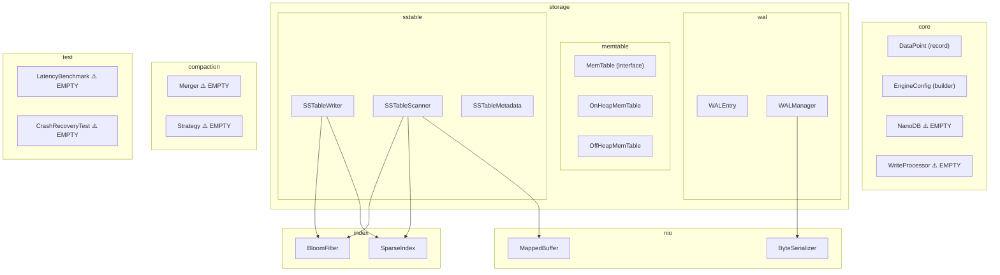

# NanoTSDB — Project Analysis

## 1. Project Overview

NanoTSDB is a **JVM-based time-series storage engine** built in Java 21 with zero external runtime dependencies (only JMH for benchmarks and JUnit for tests). It follows an **LSM-tree architecture** targeting predictable, low-latency writes by being explicit about memory placement, write serialization, compaction isolation, and crash consistency.

**Tech**: Java 21, Maven, NIO / `FileChannel` / `mmap`, JMH, JUnit 5

---

## 2. Architecture Map

---

## 3. Implementation Status — File by File

| File | Status | Lines | Notes |
|------|--------|-------|-------|
| [DataPoint.java](file:///Users/shiva/Desktop/code/NanoTSDB/src/main/java/com/nano/tsdb/core/DataPoint.java) | ✅ **Done** | 14 | Java record with composite `Comparable` (seriesId, timestamp). Clean. |
| [EngineConfig.java](file:///Users/shiva/Desktop/code/NanoTSDB/src/main/java/com/nano/tsdb/core/EngineConfig.java) | ✅ **Done** | 170 | Builder pattern with sensible defaults (4MB memtable, 1% bloom FPP, etc). Well structured. |
| [NanoDB.java](file:///Users/shiva/Desktop/code/NanoTSDB/src/main/java/com/nano/tsdb/core/NanoDB.java) | ❌ **Empty shell** | 5 | This is supposed to be the engine facade orchestrating WAL → Memtable → SSTable. Currently empty. |
| [WriteProcessor.java](file:///Users/shiva/Desktop/code/NanoTSDB/src/main/java/com/nano/tsdb/core/WriteProcessor.java) | ❌ **Empty shell** | 5 | The single-writer coordinator. Not implemented. |
| [WALEntry.java](file:///Users/shiva/Desktop/code/NanoTSDB/src/main/java/com/nano/tsdb/storage/wal/WALEntry.java) | ✅ **Done** | 28 | Simple POJO with checksum computation. Works. |
| [WALManager.java](file:///Users/shiva/Desktop/code/NanoTSDB/src/main/java/com/nano/tsdb/storage/wal/WALManager.java) | ✅ **Done** | 62 | Append + fsync + replay via FileChannel. Functional but see quality notes. |
| [ByteSerializer.java](file:///Users/shiva/Desktop/code/NanoTSDB/src/main/java/com/nano/tsdb/nio/ByteSerializer.java) | ✅ **Done** | 39 | Encode/decode WAL entries with checksum verification. Works. |
| [MappedBuffer.java](file:///Users/shiva/Desktop/code/NanoTSDB/src/main/java/com/nano/tsdb/nio/MappedBuffer.java) | ✅ **Done** | 92 | mmap wrapper with eager cleaner via reflection. Solid. |
| [MemTable.java](file:///Users/shiva/Desktop/code/NanoTSDB/src/main/java/com/nano/tsdb/storage/memtable/MemTable.java) | ✅ **Done** | 29 | Interface with put/get/scan/snapshot/freeze. Clean contract. |
| [OnHeapMemTable.java](file:///Users/shiva/Desktop/code/NanoTSDB/src/main/java/com/nano/tsdb/storage/memtable/OnHeapMemTable.java) | ✅ **Done** | 92 | `ConcurrentSkipListMap`-backed. Estimated size tracking. Good. |
| [OffHeapMemTable.java](file:///Users/shiva/Desktop/code/NanoTSDB/src/main/java/com/nano/tsdb/storage/memtable/OffHeapMemTable.java) | ✅ **Done** | 147 | `DirectByteBuffer` + on-heap index. Lock-protected writes. Interesting trade-off. |
| [SSTableWriter.java](file:///Users/shiva/Desktop/code/NanoTSDB/src/main/java/com/nano/tsdb/storage/sstable/SSTableWriter.java) | ✅ **Done** | 126 | Writes `[data block][sparse index][bloom filter][footer]`. Custom binary format with magic number `0x4E545344` ("NTSD"). |
| [SSTableScanner.java](file:///Users/shiva/Desktop/code/NanoTSDB/src/main/java/com/nano/tsdb/storage/sstable/SSTableScanner.java) | ✅ **Done** | 179 | mmap-based reader with bloom filter skip, sparse index seek, point lookup, range scan, and full-table iterator. Most complex class. |
| [SSTableMetadata.java](file:///Users/shiva/Desktop/code/NanoTSDB/src/main/java/com/nano/tsdb/storage/sstable/SSTableMetadata.java) | ✅ **Done** | 20 | Record with timestamp range + entry count. Used for compaction decisions. |
| [BloomFilter.java](file:///Users/shiva/Desktop/code/NanoTSDB/src/main/java/com/nano/tsdb/index/BloomFilter.java) | ✅ **Done** | 97 | Hand-rolled bloom filter with FNV-1a + avalanche mixing. Double-hashing scheme. Serializable. |
| [SparseIndex.java](file:///Users/shiva/Desktop/code/NanoTSDB/src/main/java/com/nano/tsdb/index/SparseIndex.java) | ✅ **Done** | 132 | Binary-search over sampled key→offset entries. `findOffset` / `findEndOffset`. Serializable. |
| [Merger.java](file:///Users/shiva/Desktop/code/NanoTSDB/src/main/java/com/nano/tsdb/compaction/Merger.java) | ❌ **Empty shell** | 5 | Should implement k-way merge of SSTable iterators. |
| [Strategy.java](file:///Users/shiva/Desktop/code/NanoTSDB/src/main/java/com/nano/tsdb/compaction/Strategy.java) | ❌ **Empty shell** | 5 | Should implement size-tiered compaction strategy. |
| [LatencyBenchmark.java](file:///Users/shiva/Desktop/code/NanoTSDB/src/test/java/com/nano/tsdb/benchmark/LatencyBenchmark.java) | ❌ **Empty shell** | 5 | No JMH benchmarks written yet. |
| [CrashRecoveryTest.java](file:///Users/shiva/Desktop/code/NanoTSDB/src/test/java/com/nano/tsdb/recovery/CrashRecoveryTest.java) | ❌ **Empty shell** | 5 | No crash recovery tests written yet. |

### Summary

| Category | Implemented | Stub/Empty |
|----------|------------|-------------|
| Core | 2 (DataPoint, EngineConfig) | 2 (NanoDB, WriteProcessor) |
| Storage | 8 (WAL, Memtable, SSTable) | 0 |
| Index | 2 (BloomFilter, SparseIndex) | 0 |
| NIO | 2 (ByteSerializer, MappedBuffer) | 0 |
| Compaction | 0 | 2 (Merger, Strategy) |
| Tests | 0 | 2 (LatencyBenchmark, CrashRecoveryTest) |
| **Total** | **14 files implemented** | **6 files empty** |

---

## 4. README Accuracy Audit

| README Claim | Code Reality | Verdict |
|-------------|-------------|---------|
| "WAL ✅" | `WALManager` + `WALEntry` + `ByteSerializer` — append, fsync, replay all implemented | ✅ Accurate |
| "Memtable ✅" | `MemTable` interface + `OnHeapMemTable` + `OffHeapMemTable` — put/get/scan/freeze/snapshot all work | ✅ Accurate |
| "SSTable ✅" | `SSTableWriter` + `SSTableScanner` + `SSTableMetadata` — full write and read path | ✅ Accurate |
| "Compaction tuning 🔄" | `Merger.java` and `Strategy.java` are **completely empty** — 0 logic | ⚠️ Misleading — "tuning" implies there's something to tune. Nothing exists. |
| "Off-heap memtable (experimental) 🔄" | `OffHeapMemTable` is **fully implemented** (147 lines, DirectByteBuffer + index) | ⚠️ Under-sold — this is done, not "in progress" |
| "Extended benchmarks 🔄" | `LatencyBenchmark.java` is an **empty class** | ⚠️ Nothing exists to extend |
| "TCP Ingestion Server" in architecture | **No TCP/networking code exists anywhere** | ❌ Doesn't exist |
| "Write Coordinator (single writer)" | `WriteProcessor.java` is **empty** | ❌ Doesn't exist |
| "Compaction Worker" in architecture | Empty stubs only | ❌ Doesn't exist |
| "Crash Recovery" section | `CrashRecoveryTest.java` is empty; `WALManager.replay()` exists but nothing ties it into an engine restart | ⚠️ Partially true — WAL replay exists but no recovery orchestration |
| "CAS-based state transitions during memtable rotation" | No CAS operations for memtable rotation exist. `freeze()` is a simple volatile write | ❌ Overclaimed |
| "Lock-free read path" | `OnHeapMemTable` reads *are* lock-free (ConcurrentSkipListMap). `OffHeapMemTable` reads duplicate the buffer. SSTable reads via mmap are lock-free. | ✅ Mostly accurate |
| "Idempotent replay" | WAL replay doesn't deduplicate — no sequence numbers or idempotency keys | ⚠️ Not actually idempotent |
| "Single-writer principle for WAL + memtable" | No enforcement — no single-threaded executor, no queue. `WALManager.append()` has no synchronization | ⚠️ Claimed but not enforced |

---

## 5. Code Quality Observations

### 👍 What's Good

1. **Clean abstractions** — `MemTable` interface allows hot-swapping heap/off-heap implementations
2. **Custom binary format** — SSTable file layout with magic number, footer, sparse index, and bloom filter is well-designed
3. **Hand-rolled bloom filter** — FNV-1a with avalanche mixing is a solid choice; avoids Guava dependency
4. **mmap with eager cleanup** — `MappedBuffer.close()` attempts to invoke the cleaner reflectively to avoid GC-delayed unmap
5. **Zero dependencies** — only JMH and JUnit. The README claims "minimal dependencies by design" and the code delivers
6. **Builder pattern on EngineConfig** — proper separation of configuration with sane defaults
7. **Estimated size tracking** — `OnHeapMemTable` tracks byte estimates for the freeze threshold instead of entry count

### ⚠️ Issues & Risks

| Issue | Severity | File | Details |
|-------|----------|------|---------|
| WAL has no write synchronization | **High** | [WALManager.java](file:///Users/shiva/Desktop/code/NanoTSDB/src/main/java/com/nano/tsdb/storage/wal/WALManager.java) | `append()` is not synchronized. Multiple threads calling append concurrently will produce corrupted WAL entries (interleaved length prefixes and data). |
| No WAL truncation / rotation | **High** | WALManager | WAL grows forever. No truncation after memtable flush. Will eventually fill disk. |
| No checksum on WAL length prefix | **Medium** | WALManager | If the length prefix is corrupt, `replay()` reads an arbitrary length of bytes, potentially allocating huge buffers (`ByteBuffer.allocate(len)`). |
| ByteSerializer uses platform charset | **Medium** | [ByteSerializer.java](file:///Users/shiva/Desktop/code/NanoTSDB/src/main/java/com/nano/tsdb/nio/ByteSerializer.java) | `getBytes()` without charset on line 9 uses platform default. `SSTableWriter` uses `UTF_8`. Inconsistency can corrupt data across platforms. |
| OffHeapMemTable doesn't handle updates | **Medium** | [OffHeapMemTable.java](file:///Users/shiva/Desktop/code/NanoTSDB/src/main/java/com/nano/tsdb/storage/memtable/OffHeapMemTable.java) | Overwriting a key appends new data but the old bytes are leaked (dead space in the direct buffer). The index correctly points to the new offset, but the old entry wastes buffer space. |
| `int` cast on SSTable offsets | **Medium** | [SSTableScanner.java](file:///Users/shiva/Desktop/code/NanoTSDB/src/main/java/com/nano/tsdb/storage/sstable/SSTableScanner.java#L81) | `int pos = (int) startOffset` — breaks on SSTables > 2GB. `MappedBuffer` itself is limited to `int` positions (MappedByteBuffer limitation). |
| No directory creation | **Low** | WALManager, SSTableWriter | Neither creates parent directories. Will throw `NoSuchFileException` if `data/wal/` or `data/segments/` don't exist. |
| MappedBuffer cleaner uses reflection | **Low** | [MappedBuffer.java](file:///Users/shiva/Desktop/code/NanoTSDB/src/main/java/com/nano/tsdb/nio/MappedBuffer.java#L80) | Will fail silently on JDK 17+ with `--illegal-access=deny` (default). Should use `sun.misc.Unsafe` or `java.lang.ref.Cleaner` API. |
| WALEntry checksum is weak | **Low** | [WALEntry.java](file:///Users/shiva/Desktop/code/NanoTSDB/src/main/java/com/nano/tsdb/storage/wal/WALEntry.java) | Uses `hashCode()`-based checksum (31 * h + ...). This has high collision rates. CRC32 or xxHash would be more appropriate for data integrity. |

---

## 6. What's Missing to Make This "GOAT Level"

### 🔴 Critical (the engine doesn't actually work end-to-end)

1. **`NanoDB` — The Engine Facade**
   - Orchestrate: WAL → active Memtable → freeze → flush to SSTable
   - Manage list of active SSTables for reads
   - Coordinate memtable rotation (active + immutable)

2. **`WriteProcessor` — Single Writer Thread**
   - Accept writes via a queue / disruptor
   - Serialize WAL append → memtable mutation
   - Enforce the single-writer principle that the README claims

3. **Compaction (`Merger` + `Strategy`)**
   - K-way merge using the existing `SSTableScanner.iterator()`
   - Size-tiered strategy: group SSTables by size, merge when threshold hit
   - Atomically swap old SSTables for merged output

4. **Read path coordination**
   - Query memtable first, then SSTables newest-to-oldest
   - Merge results across levels
   - The SSTableScanner is ready; just needs orchestration

### 🟡 Important (credibility + correctness)

5. **WAL synchronization** — `synchronized` or `ReentrantLock` on `append()`
6. **WAL truncation** — Truncate/rotate after successful SSTable flush
7. **Crash recovery orchestration** — On startup: replay WAL → rebuild memtable → discover existing SSTables
8. **Fix ByteSerializer charset** — Use `StandardCharsets.UTF_8` explicitly
9. **Tests** — At minimum:
   - WAL append + replay roundtrip
   - Memtable put/get/scan/freeze
   - SSTable write + read roundtrip
   - Bloom filter false-positive rate verification
   - Crash recovery: write, kill, replay, verify

### 🟢 Polish (senior-level signal)

10. **JMH benchmarks** — Write latency P50/P99, read throughput, compaction impact
11. **Metrics / observability** — Counters for writes, flushes, compaction runs, bloom filter hit rates
12. **TCP ingestion server** — Simple Netty or raw `ServerSocketChannel` accepting line-protocol writes
13. **CRC32 checksums** — Replace the hashCode-based checksum in WALEntry
14. **Configurable fsync policy** — The config defines it, but `WALManager` always does manual `fsync()` — no batch mode

---

## 7. Project Stats

| Metric | Value |
|--------|-------|
| Total Java source files | 20 |
| Implemented files | 14 |
| Empty stub files | 6 |
| Total lines of code (impl) | ~1,300 |
| Total lines of code (stubs) | ~30 |
| External runtime dependencies | 0 |
| Test dependencies | JUnit 5, JMH |
| Actual tests written | 0 |
| Git commits | 6 |

---

## 8. Verdict

> **The individual building blocks are solidly built. The engine as a whole doesn't exist yet.**

You have a good WAL, a good memtable (both variants), a good SSTable writer/reader with bloom filter and sparse index, and a clean config system. These are the hard parts done right.

What's missing is the **orchestration layer** — the `NanoDB` facade that ties everything together into a working storage engine. Without it, you have excellent components but no product. The compaction subsystem is entirely unimplemented, and there are zero tests.

The README **over-promises** in several places (CAS-based transitions, idempotent replay, TCP server, single-writer enforcement) that don't exist in code. Fix these claims or implement them.

**Bottom line**: You're ~60% done on implementation, ~0% on testing, and ~0% on the engine orchestration that would let someone actually *use* NanoTSDB.
